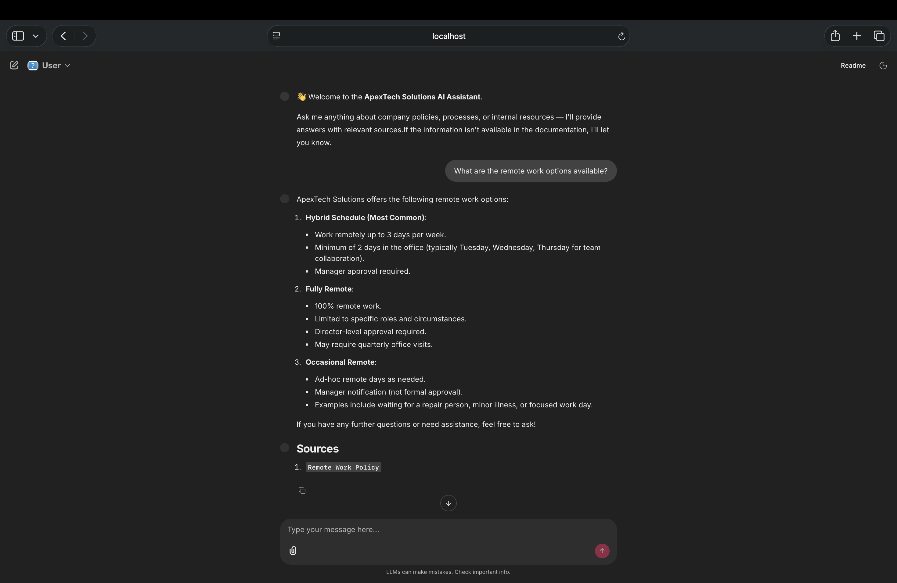

# 🏢 ApexTech Solutions — Company Knowledge Base

An internal AI-powered assistant that allows ApexTech employees to query company documentation using natural language. Built with **RAG (Retrieval-Augmented Generation)**, it retrieves relevant information from internal documents and generates accurate, sourced answers.

---

## 📸 Demo




> Developer Mode — Full metrics including token usage, cost, latency, and similarity scores


---

## 🏗️ Architecture

```
                        ┌─────────────────────────────────────────────┐
                        │              main.py (Entry Point)           │
                        │                                             │
                        │  1. Check vector store                      │
                        │  2. Run ingest if empty                     │
                        │  3. Test RAG pipeline                       │
                        │  4. Launch Chainlit UI                      │
                        └─────────────────┬───────────────────────────┘
                                          │
               ┌──────────────────────────┼──────────────────────────┐
               │                          │                          │
               ▼                          ▼                          ▼
┌──────────────────────┐   ┌──────────────────────┐   ┌──────────────────────┐
│      ingest.py       │   │      answer.py        │   │       ui.py          │
│                      │   │                      │   │                      │
│ 1. Load documents    │   │ 1. Load vector store │   │ - Chat profiles      │
│    (.pdf, .csv, .md, │   │ 2. Embed query       │   │   (User/Developer)   │
│    .xlsx, .docx)     │   │ 3. Retrieve top-5    │   │ - Display answers    │
│ 2. Normalize text    │   │    similar chunks    │   │ - Show sources       │
│ 3. Remove duplicates │   │ 4. Build prompt      │   │ - Show metrics       │
│ 4. Chunk documents   │   │ 5. Query LLM         │   │   (Dev mode only)    │
│ 5. Embed & store     │   │ 6. Return metrics    │   │                      │
│    in ChromaDB       │   │                      │   │                      │
└──────────┬───────────┘   └──────────┬───────────┘   └──────────────────────┘
           │                          │
           ▼                          ▼
┌──────────────────────┐   ┌──────────────────────┐
│  ChromaDB            │   │   OpenAI             │
│  (Vector Store)      │◄──│                      │
│                      │   │ - text-embedding-    │
│  ./data/vector_db    │   │   3-large (Embed)    │
│                      │   │ - gpt-4o-mini (LLM)  │
└──────────────────────┘   └──────────────────────┘
```

### RAG Pipeline Flow

```
User Query
    │
    ▼
Embed Query (text-embedding-3-large)
    │
    ▼
Similarity Search in ChromaDB (top-5 chunks)
    │
    ▼
Build Prompt (System + History + Context + Query)
    │
    ▼
Query LLM (gpt-4o-mini)
    │
    ▼
Return Answer + Sources + Metrics
    │
    ▼
Display in Chainlit UI
```

---

## 📁 Project Structure

```
company-knowledge-base/
│
├── main.py               # Entry point — checks vector store, tests pipeline, launches UI
├── answer.py             # RAG pipeline — retrieval, LLM, metrics
├── ingest.py             # Ingestion pipeline — load, normalize, chunk, embed, store
├── ui.py                 # Chainlit UI — User and Developer chat profiles
│
├── data/
│   ├── raw/              # Source documents
│   │   ├── benefits.md
│   │   ├── Benefits_Comparison.csv
│   │   ├── Company_Directory.csv
│   │   ├── company_wiki.md
│   │   ├── employee_handbook.md
│   │   ├── expense_policy.md
│   │   ├── hr_policies.md
│   │   ├── it_support_guide.md
│   │   ├── onboarding_guide.md
│   │   ├── remote_work_policy.md
│   │   ├── security_policy.md
│   │   └── training_materials.md
│   │
│   └── vector_db/        # ChromaDB persistent vector store (auto-generated)
│
├── chainlit.md           # Chainlit welcome screen
├── .env                  # Environment variables (not committed)
├── .gitignore
├── pyproject.toml        # Project dependencies (uv)
└── README.md
```

---

## ⚙️ Tech Stack

| Component | Technology |
|-----------|------------|
| **LLM** | OpenAI `gpt-4o-mini` |
| **Embeddings** | OpenAI `text-embedding-3-large` (1536 dimensions) |
| **Vector Store** | ChromaDB |
| **RAG Framework** | LangChain |
| **UI** | Chainlit |
| **Package Manager** | uv |
| **Language** | Python 3.12 |

---

## 🚀 Getting Started

### Prerequisites

- Python 3.12+
- [uv](https://docs.astral.sh/uv/) package manager
- OpenAI API key

### 1. Clone the repository

```bash
git clone https://github.com/your-username/company-knowledge-base.git
cd company-knowledge-base
```

### 2. Install dependencies

```bash
uv sync
```

### 3. Set up environment variables

Create a `.env` file in the root directory:

```bash
OPENAI_API_KEY=sk-your-openai-api-key-here
```

### 4. Add your documents

Place your company documents in `data/raw/`. Supported formats:

- `.pdf`
- `.csv`
- `.md`
- `.xlsx`
- `.docx`

### 5. Run the application

```bash
uv run main.py
```

`main.py` will automatically:
1. ✅ Check if the vector store exists and has documents
2. ✅ Run the ingestion pipeline if the vector store is empty
3. ✅ Test the RAG pipeline with a sample query
4. ✅ Launch the Chainlit UI at `http://localhost:8000`

---

## 💬 Chat Profiles

The UI has two modes selectable at the start of each session:

### 👤 User Mode
- Clean, readable answers
- Sources listed at the bottom
- No technical metrics

### 🛠️ Developer Mode
- Everything in User Mode
- Retrieved documents with **similarity scores**
- **Token usage** (input / output / total)
- **Cost** per query (input / output / total)
- **Latency** (response time in seconds)

---

## 📊 Metrics

Every query tracked in Developer Mode:

| Metric | Description |
|--------|-------------|
| `similarity_score` | ChromaDB cosine distance (lower = more similar) |
| `similarity_percentage` | Human-readable similarity `((2 - score) / 2) * 100` |
| `avg_similarity_score` | Average similarity across all retrieved chunks |
| `input_tokens` | Tokens sent to the LLM |
| `output_tokens` | Tokens returned by the LLM |
| `total_tokens` | Total tokens used |
| `input_cost` | Cost of input tokens in USD |
| `output_cost` | Cost of output tokens in USD |
| `total_cost` | Total query cost in USD |
| `latency` | End-to-end response time in seconds |

---

## 🔄 Ingestion Pipeline

The ingestion pipeline in `ingest.py` processes documents in 5 steps:

```
1. Load       → Supports PDF, CSV, Markdown, Excel, Word
2. Normalize  → Fix unicode, whitespace, newlines
3. Deduplicate → Remove exact duplicate chunks using MD5 hashing
4. Chunk      → Split into 1500-character chunks (300 overlap)
5. Embed & Store → OpenAI embeddings → ChromaDB
```

### Re-ingesting documents

If you add or update documents in `data/raw/`, delete the vector store and re-run:

```bash
rm -rf data/vector_db
uv run main.py
```

---

## 🌐 Sharing the UI

### Local network
The UI runs on `http://localhost:8000` by default.

### Public URL (via ngrok)

**Terminal 1:**
```bash
uv run main.py
```

**Terminal 2:**
```bash
ngrok http 8000
```

This generates a public URL like `https://abc123.ngrok-free.app` that anyone can access.

> ⚠️ The ngrok URL changes every time you restart. For a permanent URL, consider deploying to [Railway](https://railway.app) or [Render](https://render.com).

---

## 🧪 Example Questions

### ✅ Questions the assistant can answer

| Document | Question |
|----------|----------|
| `remote_work_policy.md` | What are the remote work options available? |
| `employee_handbook.md` | How many vacation days do employees get? |
| `onboarding_guide.md` | What should I do on my first day? |
| `expense_policy.md` | How do I submit an expense report? |
| `it_support_guide.md` | How do I reset my password? |
| `security_policy.md` | What are the password requirements? |
| `benefits.md` | What health insurance options are available? |
| `Company_Directory.csv` | Who is the HR manager? |

### ❌ Questions it will say it doesn't know

- What is the stock price of ApexTech?
- What is the salary range for a Senior Engineer?
- How many employees does ApexTech have globally?
- Can you compare ApexTech's benefits to Google's?

---

## 🔒 Environment Variables

| Variable | Description | Required |
|----------|-------------|----------|
| `OPENAI_API_KEY` | Your OpenAI API key | ✅ Yes |

---

## 📦 Dependencies

Key packages used (see `pyproject.toml` for full list):

```
langchain
langchain-openai
langchain-chroma
langchain-community
chainlit
chromadb
python-dotenv
unstructured
openpyxl
msoffcrypto-tool
```

---

## 📄 License

This project is for internal use at ApexTech Solutions.
